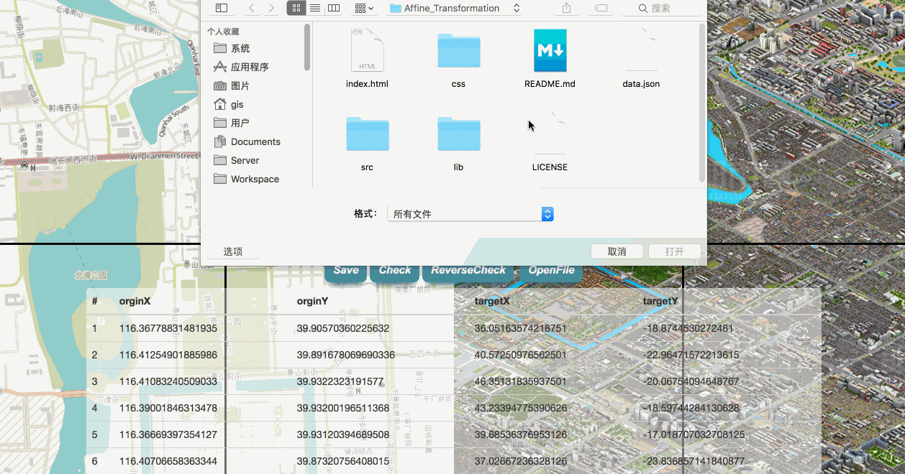

# Affine_Transformation

By 2nd order polynomial correct points.

## Dependent JS

* [sylvester.js](http://sylvester.jcoglan.com/)
* [leaflet.js](http://leafletjs.com/)

## [Demo](https://bkgiser.github.io/Affine/)



## GetStart

```javascript

var mat = new MatrixCalc(Arr);

mat.to_target(x,y); //{x: targetX, y: targetY}

mat.to_orgin(x,y); // {x: oX, y: oY}

mat.A;  //transform parameter
mat.B;  //transform parameter
mat.C;  //transform parameter
mat.D;  //transform parameter
mat.E;  //transform parameter
mat.F;  //transform parameter


```


```javascript

//properties must be more than 7
var Arr = [
  {
    "from": [
      116.36778831481935,
      39.90570360225632
    ],
    "to": [
      36.05163574218751,
      -18.8744530272481
    ]
  },
  {
    "from": [
      116.41254901885986,
      39.891678069690336
    ],
    "to": [
      40.57250976562501,
      -22.96471572213615
    ]
  },...
]

```

## Why

When some online map too same but still has position difference, we could use this method find transform parameters,
and we could get where is different, I know every PC software could do this, but website more convenient, 
when we couldn't update online map, however we could update points. 

## License

MIT
